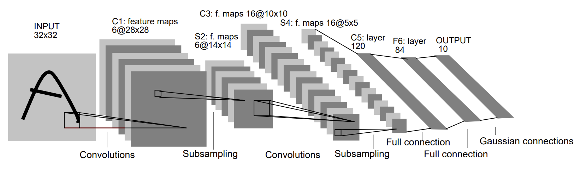

# LeNet CUDA

CUDA-accelerated inference for a modified LeNet-style convolutional neural
network on 86x86 Fashion-MNIST images. The project compares a CPU convolution,
a basic CUDA implementation, input-unrolling/GEMM approaches, kernel fusion,
and a final architecture-specific optimized implementation.

> **Repository status:** This is ECE 408 coursework and must remain private
> unless the course staff provides explicit written permission to publish it.



## Implementation Structure

The project is organized as an optimization progression rather than a single
CUDA kernel:

| Stage | Target | Method |
| --- | --- | --- |
| CPU baseline | `m1_cpu` | Direct convolution on the CPU |
| CUDA baseline | `m1_gpu` | Direct convolution with one CUDA thread per output element |
| Explicit GEMM | `m2_unroll` | Input unrolling, tiled matrix multiplication, then output permutation |
| Fused GEMM | `m2_fused` | Implicit input unrolling inside a tiled convolution/GEMM kernel |
| Final kernel | `m3`, `lenet_cuda` | Layer-specific combination of tiling, coarsening, constant memory, FP16, and WMMA |

The final implementation in
[`src/layer/custom/m3-forward.cu`](src/layer/custom/m3-forward.cu) specializes
the two convolution layers:

- **Layer 1:** FP32 direct convolution using shared-memory input strips,
  constant-memory weights, register accumulation, and four-column thread
  coarsening.
- **Layer 2:** batch-paired FP16 input-strip construction and WMMA Tensor Core
  matrix multiplication with FP32 accumulation.

Benchmark mode performs warm-up passes and reports the median measured kernel
time.

## Optimization Experiments

Each directory under [`experiments/`](experiments/) isolates one optimization
so it can be compared with its appropriate baseline.

| ID | Short name | Method |
| --- | --- | --- |
| `req_0` | **Multi-Stream Pipeline** | Splits the batch across four CUDA streams and overlaps pinned-memory transfers with unrolling, GEMM, and permutation |
| `req_1` | **WMMA Tensor Cores** | Replaces scalar tiled GEMM with 16x16x16 FP16 WMMA operations and FP32 accumulation |
| `op_0` | **Constant Weights** | Places convolution masks in CUDA constant memory for cached, broadcast-friendly access |
| `op_1` | **Restricted Pointers** | Adds `__restrict__` qualifiers to remove pointer-aliasing uncertainty |
| `op_2` | **Unrolled FMA Loop** | Manually expands the inner 16-element dot product into groups of four FMAs |
| `op_4` | **cuBLAS SGEMM** | Uses explicit input unrolling followed by `cublasSgemm` and output permutation |
| `op_5` | **FP16 Half2** | Converts inputs and weights to FP16 and performs paired arithmetic with `__half2` |
| `op_6` | **Register/Shared Tiling** | Gives each thread a register output tile while cooperatively loading larger shared-memory tiles |
| `competition.cu` | **Hybrid Layer Specialization** | Combines a tiled FP32 first-layer kernel with a batch-paired WMMA second-layer kernel |

The `archive/` directory contains earlier strip-tiled and WMMA development
snapshots. See [the experiment catalog](experiments/README.md) for details,
baseline relationships, and source paths.

## Repository Layout

```text
.
|-- src/                         Mini-DNN layers and CUDA support
|   `-- layer/custom/            Convolution kernels
|-- experiments/                 Isolated optimization variants and catalog
|-- scripts/                     Delta/Slurm job examples
|-- third_party/eigen/           Vendored Eigen dependency
|-- assets/                      Architecture diagram
|-- CMakeLists.txt
|-- ece408net.cc                 Network definition and model loading
|-- m1_cpu.cc                    CPU baseline entry point
|-- m1_gpu.cc                    CUDA inference and benchmark entry point
`-- weights-86.bin               Pretrained model parameters
```

Generated logs, profiler databases, reports, and build products are excluded
from version control.

## Requirements

- Linux
- CMake 3.20+
- CUDA Toolkit with `nvcc`
- NVIDIA GPU with compute capability 8.0 or 8.6 by default

The optimized kernels target Ampere Tensor Cores. Override the CUDA
architectures at configure time when needed.

## Build

```bash
cmake -S . -B build -DCMAKE_BUILD_TYPE=Release
cmake --build build --parallel
```

For a different GPU architecture:

```bash
cmake -S . -B build -DCMAKE_BUILD_TYPE=Release \
  -DCMAKE_CUDA_ARCHITECTURES=86
```

## Dataset

The executables expect the resized Fashion-MNIST IDX files:

```text
t10k-86-images-idx3-ubyte
t10k-86-labels-idx1-ubyte
```

Set the dataset directory before running outside the course cluster:

```bash
export LENET_DATA_DIR=/path/to/fmnist-86
```

The default path is `/projects/bche/project/data/fmnist-86/`. The pretrained
weights default to `weights-86.bin`; override that with
`LENET_WEIGHTS_PATH=/path/to/weights-86.bin`.

## Run

Run inference for a selected batch size:

```bash
./build/lenet_cuda 10000
```

Run repeated kernel timing:

```bash
./build/lenet_cuda 10000 --competition
```

Other build targets preserve the implementation stages:

```text
m1_cpu    CPU convolution baseline
m1_gpu    basic CUDA convolution
m2_unroll explicit input unrolling plus GEMM
m2_fused  fused implicit-GEMM convolution
m3        final optimized implementation
viz       feature-map export utility
```

## Profiling

Examples for NVIDIA Nsight Systems and Nsight Compute:

```bash
nsys profile --stats=true ./build/lenet_cuda 10000
ncu --set full ./build/lenet_cuda 10000
```

Cluster-specific Slurm examples are under `scripts/`.

## Acknowledgments

The network framework is based on
[mini-dnn-cpp](https://github.com/iamhankai/mini-dnn-cpp). See `LICENSE` for
the supplied framework license.
